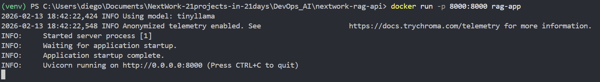
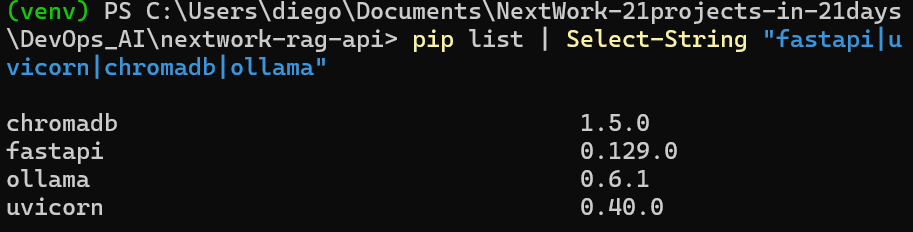
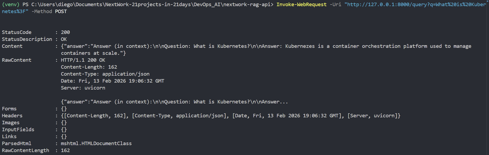
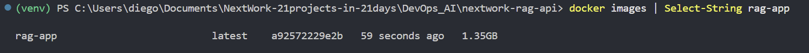
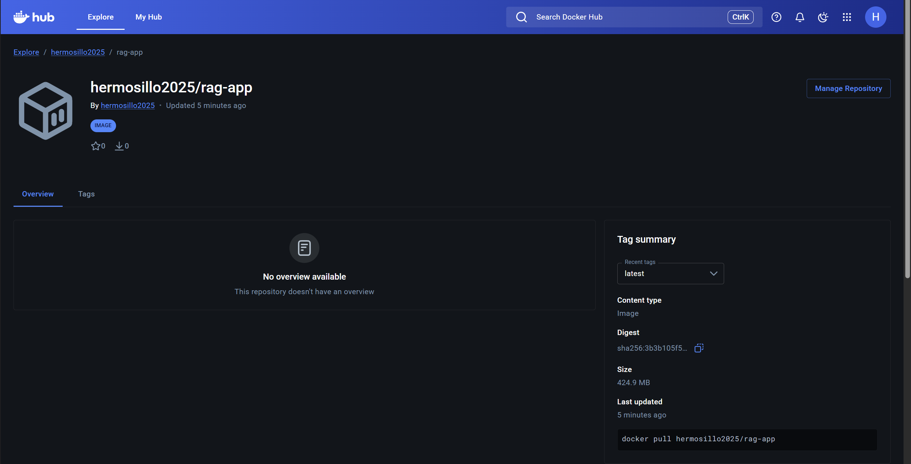
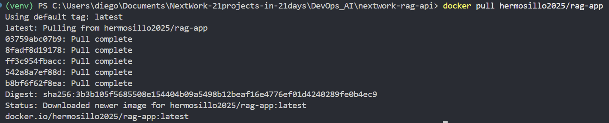

# Containerize a RAG API with Docker

**Project Link:** [View Project](http://learn.nextwork.org/projects/ai-devops-docker)

**Author:** Diego Rocha Velazquez  
**Email:** diego.rocha@hermosillo.com

---

---

## Introducing Today's Project!

In this project, I will demonstrate how to contenarize a RAG API with Docker. I'm doing this project to deepen my Docker knowledge, especially with FastAPI which is a framework I only recently started using.

### Key services and concepts

Services I used were Docker and Docker Hub. Key concepts I learnt include dockerfiless, images, containers, and Docker Hub which is basically GitHub for Docker images.

### Challenges and wins

This project took me approximately two hours. The most challenging part was connecting the Ollama calls from inside the container to the actual Ollama app that was running on my machine (external to the container). It was most rewarding to build a whole Docker project end-to-end, creating the dockerfile, building the image, running the image, uploading and pulling from Docker Hub, and running the pulled image.

### Why I did this project

I did this project because I wanted to reinforce my Docker knowledge, especially with a practical project that builds on the new technologies that I learned recently like FastAPI. I also hadn't combined Docker and AI/RAG apps yet so I was also very interested in getting hands-on with that.

---

## Setting Up the RAG API

In this step, I'm setting up a RAG API using FastAPI, Chroma, and Ollama. The RAG API is an API that will use documents to answer questions. How it works is it receives a request from a user, retrieves relevant information from the knowledge base (Chroma database), and passes the results as context to a local LLM served through Ollama. Finally, the API is also responsible for passing the generated response back to the user. 

### API setup and workspace

In this step, I'm installing Docker Desktop. Docker is a containerization platform , which means engineers use it to package their application and all its dependencies so that it can run the same anywhere.

### Dependencies installed

The packages I installed are FastAPI, Uvicorn, ChromaDB, and Ollama. FastAPI is the web framework that helps us with developing our API. Uvicorn is used as the server that runs our FastAPI app. Chroma is used for storing and processing the vector embeddings in our knowledge base. Ollama is our Python client used for interacting with the Ollama app.

### Local API working

I tested that my API works by running the API in a terminal and then querying it through another terminal. The local API responded correctly the Kubernetes query test question, saying that it is an orchestration platform that helps manage containers at scale. This confirms that the API is successfully using documents from the knowledge base.

---

## Installing Docker Desktop

### Docker Desktop setup

Docker Desktop is a user friendly application that bundles the Docker Engine (the core software that actually creates containers), CLI, and other tools into a single package. I installed it because using Docker Desktop makes interacting with Docker a lot more visual and user-friendly. Containerization will help the project by packaging the application into a single container (package) that can be ran anywhere.

I installed it because... Containerization will help my project by...

### Docker verification

I verified Docker is working by running: "docker run hello-world", which proves that my local docker can pull images from the internet, and it can also create and run containers.

---

## Creating the Dockerfile

In this step, I'm containerizing the API. This means building a docker image that packages up the RAG API and all of its dependencies. In order to build that Docker image, I must write a Dockerfile first, which is basically a file with the instructions (the recipe) about how Docker is supposed to build the image of the app.

### How the Dockerfile works

A Dockerfile is the file containing the instructions that tell Docker how to build a Docker image of a given app/service. The key instructions in my Dockerfile are to set up the environment via package installations and creating the vector embeddings to set up the databse. FROM tells Docker to build from a base Python image. COPY is used for copying the app's files from the local project directory. RUN executes the commands for installing dependencies and creating vector embeddings. Finally, CMD defines a command that the container should run on startup so that it's running the API.

### Containerized API test results

Testing the API after containerization proved that the API was still functioning and could return a response to questions. The difference between running locally and in Docker is that we are pointing to our local running instance of Ollama when running the API locally, but the containerized API needed to create a specialized Ollama client and host that maps to the correct port on the local machine (instead of in the container). Containerization helps because it saves people the time and effort that can come with sharing tools with each other; if our environments are different it would take some time to set up the environment just to run an app. Containerization also helps a lot with deploying to servers, you don't have to manually setup each server, the Docker image handles that for you.

---

## Building and Running the Container

### Docker image build complete

Building a Docker image involves getting Docker to read the Dockerfile, and then executing every single line from top to bottom. I verified my Docker image was built successfully by running the command that returns a list of all our Docker images, specially filtering for the image titled rag-app. This confirms that my API is now containerized because the code files were copied, the key dependencies (e.g. chroma) are installed, the vector embeddings were created and the command for starting the RAG API was run as a part of Docker creating this image. This encapsulates all the core things the environment would need to run this API.

---

## Pushing to Docker Hub

In this project extension, I'm pushing to Docker Hub. Docker Hub is a container registry, which is like what GitHub is to code. I'm doing this because by pushing the image to Docker Hub, I get to publish it publicly and be able to pull and run it from any computer.

### Docker Hub push complete

I pushed to Docker Hub by running the docker push to my image where I referenced its new tag that has my username in it. Docker Hub is useful because it is public and free to use and lets us publish our image to the public. The advantage of pushing to a registry is that others can now easily use the application by pulling from the central public space for images.

### Pulling from Docker Hub

Pulling an image from Docker Hub means downloading an image that's been uploaded/shared via Docker Hub. When I ran docker pull, Docker was installing a local copy of the exact image that I'd just uploaded. The difference between building locally and pulling from Docker Hub is that I can easily switch computers and still be able to run my containerized API. This helps me work from multiple different places, instead of just one.

---

---
