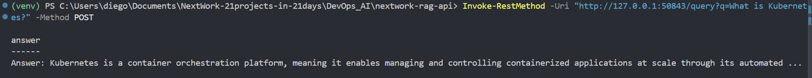
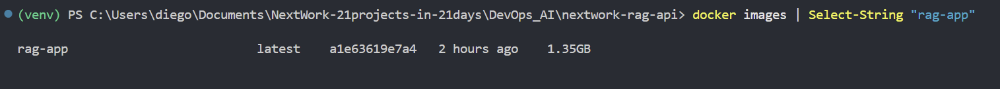
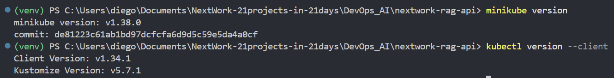
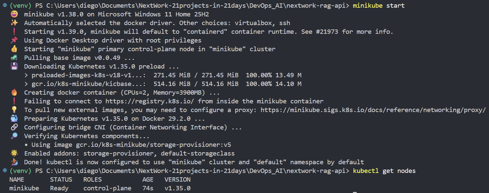
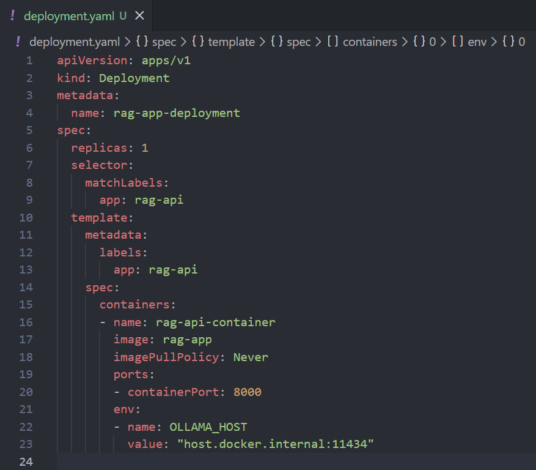
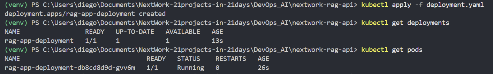
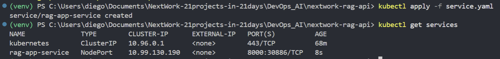
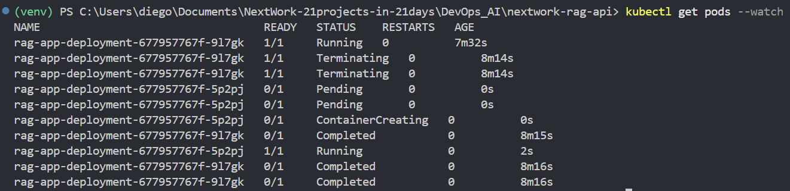
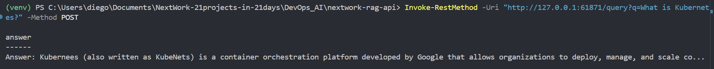

# Deploy a RAG API to Kubernetes

**Project Link:** [View Project](http://learn.nextwork.org/projects/ai-devops-kubernetes)

**Author:** Diego Rocha Velazquez  
**Email:** diego.rocha@hermosillo.com

---

---

## Introducing Today's Project!

In this project, I will deploy the RAG API using Kubernetes. I'm doing this project to learn how Kubernetes works and why people use them today. Kubernetes will help me with managing and scaling containers; which is extremely useful at scale i.e. when you've got a ton of containers that you need to coordinate.

### Key services and concepts

Key concepts I learnt include Kubernetes, Minikube, clusters, Deployments, Services, NodePorts, and self-healing. Kubernetes provides container orchestration by automating the deployment, scaling, networking, and management of containers across a cluster. A cluster is a group of nodes (machines) running containerized applications managed by Kubernetes, while Minikube allows you to run a local single-node Kubernetes cluster for development and testing. Deployments manage application replicas by defining the desired state, creating and updating Pods, handling rolling updates, and ensuring self-healing by automatically recreating failed Pods. Services route traffic to Pods by providing stable networking and load balancing, and a NodePort Service exposes an application externally through a port on each node. Self-healing ensures that Kubernetes automatically restarts failed containers, replaces unhealthy Pods, and maintains the desired number of replicas.

### Challenges and wins

This project took me approximately two hours to complete. The most challenging part was understanding all the components that makes the Service work. Specially how the "host.docker.internal" can bypass all the levels of abstraction and reach the local machine that serves Ollama, but for standart requests it has to got through the service, which in turn comunicates with the Pod, which forwards the request to the container which is running the app. It was most rewarding to se the post requests go through, getting the answer from the local LLM, and also seeing Kubernetes self-healing in action.

### Why I did this project

I did this project because I wanted to learn Kubernetes and gain some hands on experience. One thing I'll apply from this is how to run and access containerized applications that are running in Kubernetes clusters (i.e. using Deployments and Services).

---

## Setting Up My Docker Image

In this step, I'm setting up a Docker image, which is a package that contains our app's code, dependencies, and settings, etc. I need a Docker image because Kubernetes requires one so that it knows what kind of containers it's running, scaling, managing, etc.

### What the Docker image contains

I ran docker images and saw that I've got a Docker image called rag-app. The image size was 1.35GB. The IMAGE ID was a1e63619e7a4.

### Docker image vs container

---

## Installing Kubernetes Tools

In this step, I'm installing Minikube and kubectl. I need these tools because I will be using Minikube to start and run a Kubernetes cluster locally, and then kubectl is useful for running  commands that lets me control the cluster; e.g. view logs, show what services and pods are running.

### Verifying the tools are installed

I installed Minikube using Winget and the simple command "winget install -e --id Kubernetes.minikube". I installed kubectl by running the command "winget install -e --id Kubernetes.kubectl". Both were pretty easy and downloaded in a couple of minutes. I could tell both installations were successful by checking the version numbers of each.

### Minikube vs kubectl

---

## Starting My Kubernetes Cluster

In this step, I'm starting a Minikube. Minikube will create a single-node cluster. I also need to load a Docker image into Minikube.

### Loading the Docker image into Minikube

I started the cluster by running the command "minkube start" and saw lots of status updates in the terminal as Minikube prepared and started the services necessary for our Kubernetes cluster to work. Then I ran "kubectl nodes" to check the status of the nodes (or node in this case). kubectl get nodes showed the status as Ready which tells us that our cluster is ready to load our Docker image.

### Why load image into Minikube

The "minikube docker-env | Invoke-Expression" command switches the environment that the commands point to; after running this command, every Docker command I ran after pointed to Minikube's environment instead of my own local environment. Without loading the image into Minikube, Kubernetes would not have an image for creating and running containers - the RAG API simply would not be running. This is different from regular Docker because Kubernetes does not create images, Docker does; but Kubernetes is used for managing and scaling containers once they're created.

---

## Deploying to Kubernetes

In this step, I'm deploying the RAG API using Kubernetes. I need a Deployment because that is responsible for telling Kubernetes how many copies of the app we're running, what version of the app we're running, etc. It defines the 'ideal state' of our app that Kubernetes will try to maintain.

### How the Deployment keeps my app running

The deployment.yaml file tells Kubernetes how to run the app. The key parts define the app name, labels, and container configuration. The image field specifies which Docker image (rag-app) Kubernetes should run. The replicas field means how many copies of the app (pods) should run at the same time.

### What did you observe when checking your pods?

I ran kubectl get pods and saw one pod running. The pod had the name rag-app-deployment-db8cd8d9d-gvv6m and status Running, which means the container started successfully. The READY column showed 1/1, which indicates the container inside the pod is healthy and ready to serve traffic.

---

## Creating a Service

In this step, I'm creating a Service. I need a Service because it provides a stable networking endpoint i.e. a stable IP address that lets us connect our API. If a Service didn't exist, then we'd have to connect directly to the Pod that's running the containerized API (and this connection would break everytime that a Pod gets by Kubernetes, because it would respawn with a new IP).

### What does the service.yaml file do?

The service.yaml file tells Kubernetes how to expose the app to the network. The selector finds Pods by matching the label app: rag-api. The port configuration allows traffic to reach the container on port 8000. NodePort enables access from outside by opening a port on the node that forwards traffic to the service.

### What kubectl commands did you run to create the service?

I applied my Service file by running "kubectl apply -f service.yaml". I then verified that the Service was created by running "kubectl get services", and confirming that the Service (which is named rag-app-service) was running.  

---

## Accessing My API Through Kubernetes

In this step, I'm testing the API thtrough Kubernetes. I will be accessing the API using NodePort and then running the classic "What is Kubernetes" question with our RAG API, now running via a Kubernetes cluster.

### How I accessed my API

I tested my API by running the Invoke-RestMethod command 'Invoke-RestMethod -Uri "http://127.0.0.1:50843/query?q=What is Kubernetes?" -Method POST'. The response showed a generated response explaining what is Kubernetes. This confirms that the API still works, even when it's been containerized and is now running in a Kubernetes cluster. The main difference between Docker and Kubernetes deployment is that Docker = running a container, while Kubernetes = running in a cluster (multiple pods/containers), where container management is handled for us.

### Request flow through Kubernetes

The request flow went from my computer to the NodePort URL (port 30886) then to Kubernetes Service (port 8000) then to the Pod with label "rag-api". The Service routed traffic by selecting the pod with the label "rag-api".

---

## Testing Self-Healing

In this project extension, I'm demonstrating Kubernetes' self-healing abilities. Self-healing is important because it ensures that out app stays running (high availability); even if a Pod (i.e. a group of containers) is unhealthy or no longer running, Kubernetes can replace it with a healthy Pod so that incoming traffic can still get their requests served. In other words, users get uninterrupted service.

### What did you observe when you deleted the pod?

When I deleted the pod, I saw the status change from Running to Terminating to Completed. A new pod was created because Kubernetes was comparing its desired state (stated in the deployment.yaml file) with its actual state (i.e. the reconciliation loop) and tried to close the gap by creating a new Pod so that the desired state (where there is one pod) is reached.

### How the Service routed traffic to the new pod

The Service automatically would have routed traffic to the new Pod because the new Pod would have been created with the label "rag-api", which is the selector the Service uses to connect to the new Pod. Without Kubernetes, deleting this running container would have caused the entire RAG API to stop working. Self-healing is critical in production because it saves the day when there are events that cause containers to crash. New Pods/Containers automatically get created to run the RAG API, which ensure that production systems stay available.

---

---
