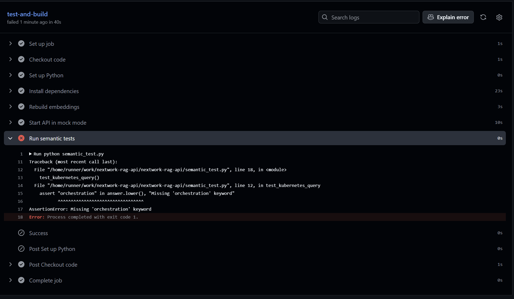
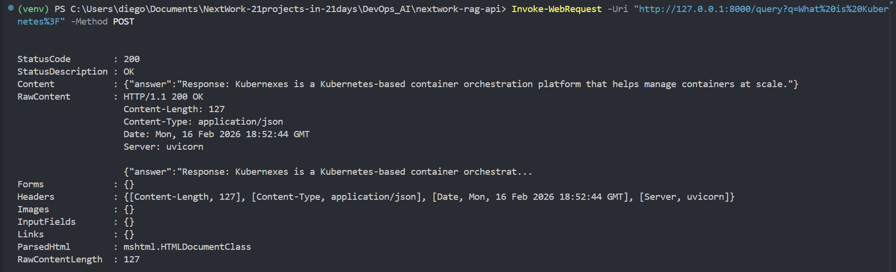
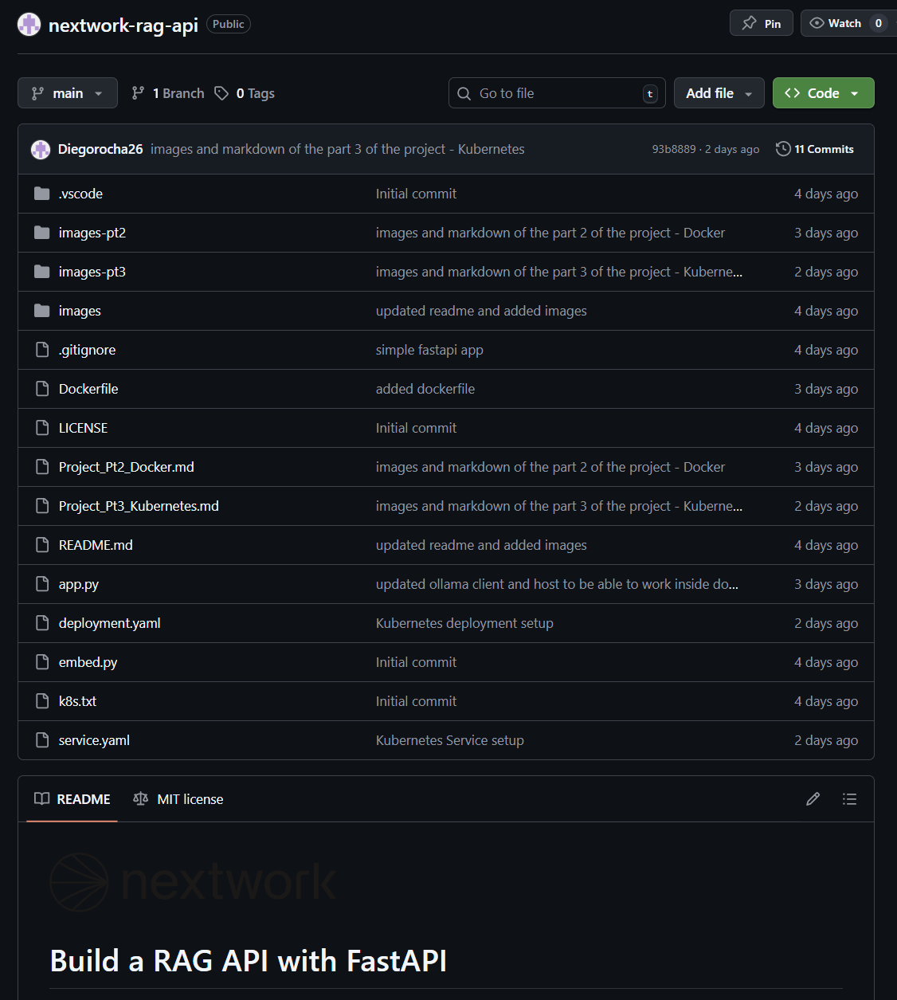
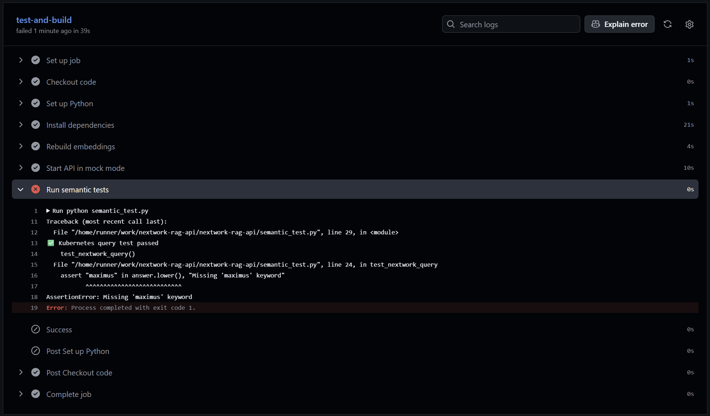

# Automate Testing with GitHub Actions

**Project Link:** [View Project](http://learn.nextwork.org/projects/ai-devops-githubactions)

**Author:** Diego Rocha Velazquez  
**Email:** diego.rocha@hermosillo.com

---

---

## Introducing Today's Project!

In this project, I will demonstrate how to use GitHub Actions to automate a workflow for the RAG API. The workflow we're automating is about testing the performance of our API in terms of semantic meaning (and catch any semantic regression). I'm doing this project to learn how to use GitHub actions and how to test the results of the RAG API.

### Key services and concepts

Services I used in this project were GitHub Actions, Ollama, FastAPI, and uvicorn to build the RAG API and automate testing a workflow. Key concepts I learnt include CI/CD, RAG, testing, semantic regression, and non deterministic tests.

### Challenges and wins

This project took me approximately 2 hours to complete. The most challenging part was understanding, spotting, and fixing non deterministic tests. It was most rewarding to see multiple files work for our knowledge base.

### Why I did this project

I did this project because I wanted to learn how GitHub Actions work and ways I can test a RAG API. One thing I'll apply from this is the concept of semantic regression and writting and spotting deterministic tests.

---

## Setting Up Your RAG API

I’m setting up my RAG API by activating my virtual environment so that the app can access the appropriate dependencies and by starting Ollama so the app can run the local LLM. A RAG API retrieves information by embedding a user query, searching a vector database for relevant context, and augmenting the LLM’s prompt with that retrieved data to generate accurate, context-aware responses. This foundation is needed for CI/CD because consistent environments, controlled dependencies, and reproducible services ensure reliable builds, automated testing, and predictable deployments across development and production.

### Local API verification

I tested my RAG API by running it locally, then querying it about Kubernetes and seeing if it provides a proper response about Kubernetes. The API responded with a short statement about what Kubernetes is, which matches with what was uploaded to the knowledge base. This confirms that the RAG API is capable of retrieving, augmenting, and generating a response.

---

## Initializing Git and Pushing to GitHub

I’m initializing Git by creating a local repository with git init, staging files with git add, and committing them with git commit to start tracking the project’s history. Git tracks changes by recording snapshots of files over time, allowing comparison between commits, branching, and reverting to previous versions when needed. Version control enables CI/CD to automatically trigger builds, tests, and deployments whenever code is pushed, ensuring consistent, traceable, and reliable software delivery.

### Git initialization and first commit

I initialized Git by running the command git init. Then, I staged and committed my project files using git add and git commit to start tracking changes and create a version history. The .gitignore file helps by specifying which files and folders (such as virtual environments, environment variables, and build artifacts) should be excluded from version control to keep the repository clean and secure.

### Pushing to GitHub for CI/CD

Pushing to GitHub means making the code available in a  GitHub repository. This enables CI/CD because this allows us to now be able to use GitHub Actions.

---

## Creating Semantic Tests

I’m creating semantic tests that verify the meaning and quality of generated responses rather than just code execution. Unlike unit tests that check code logic and individual functions, semantic tests validate that the model’s output is contextually accurate, relevant, and aligned with expected intent. These tests ensure quality by catching hallucinations, incorrect reasoning, and response drift, helping maintain reliability in LLM-powered applications.

### Non-deterministic output observation

When I ran the query multiple times, I noticed that the RAG API's responses are very random; even if the knowledge base is missing a keyword ("orchestration"), the LLM could still generate that answer in its responses. This is a problem because the result of semantic testing also become random; it could be failing or succeeding because of the knowledge base or bacause of the LLM. For CI/CD to work reliably, we need deterministic outputs i.e. outputs that give us clear conclusions.

---

## Adding Mock LLM Mode

I’m adding mock LLM mode to the RAG API. This solves the non-determinism problem by making the RAG API return only the retrieved context before sending anything to the LLM for generation. This gives us clarity that if the RAG API fails to retrieve the words “orchestration” and “containers,” the issue lies in the knowledge base or retrieval logic, not the model’s output variability. Reliable testing requires deterministic behavior, controlled inputs, and isolating system components so failures can be traced to a single, measurable source.

### How mock mode solves the problem

### Mock LLM mode for CI testing

Mock LLM mode returns the retrieved text directly, which makes tests deterministic, predictable, and easy to validate against exact expected outputs. Without mock mode, tests would be non-deterministic, potentially flaky, and influenced by LLM variability, making failures harder to diagnose. For automated CI, we need stable, repeatable results that isolate retrieval logic from generation so pipelines can reliably detect real regressions.

---

## Creating GitHub Actions Workflow

I’m creating a GitHub Actions workflow file that automates testing. The workflow automates testing by defining steps that install dependencies, set up the environment, and run the test suite automatically in a clean runner environment. When I push code, it will trigger the workflow, execute the tests, and report whether the build passes or fails, ensuring that only verified changes move forward in the development pipeline.

### Workflow automation and CI testing

I created the workflow file in the .github/workflows/ directory as ci.yml. I pushed it using git add, git commit, and git push, which triggered GitHub Actions. Once on GitHub, the workflow automatically runs on every push affecting k8s.txt, app.py, or embed.py, sets up Python 3.11, installs dependencies, rebuilds embeddings, starts the API in mock mode, executes semantic tests, and reports whether the pipeline passes or fails in the Actions tab.

---

## Testing Data Quality

I’m triggering the CI workflow by pushing changes to the repository that modify k8s.txt, app.py, or embed.py, which activates the GitHub Actions pipeline. The workflow will test the embedding rebuild process, start the API in mock mode, and run semantic tests to validate retrieval quality. I expect it to fail because I removed the keyword "orchestration" from the context file; so the semantic tests will fail.

### Data quality and CI protection

The missing keyword was “orchestration,” which is a required term in the expected retrieval output. The semantic test failed because the rebuilt embeddings no longer contained that keyword in the context, causing the retrieval validation to detect incomplete or degraded knowledge. Without CI, this degraded content would have silently shipped, reducing answer quality and potentially causing incorrect or incomplete responses in production.

---

## Testing Another Data Quality Issue

### Data quality and CI protection

---

## Scaling with Multiple Documents

I'm restructuring the project to handle multiple documents as part as the knowledge base. The new folder structure supports multiple text files. This approach scales better because real knowledge bases have lot's of files in their vector database.

### Docs folder structure and CI scaling

The docs folder organizes files by putting all knowledge documents into the same folder. The embed_docs.py script handles embeddings for all the text files within the docs folder. CI validated all documents and found that the new nextwork text file was missing a keyword. This structure supports growth because I can now add multiple documents and test the RAG API on multiple domains.

---

---
