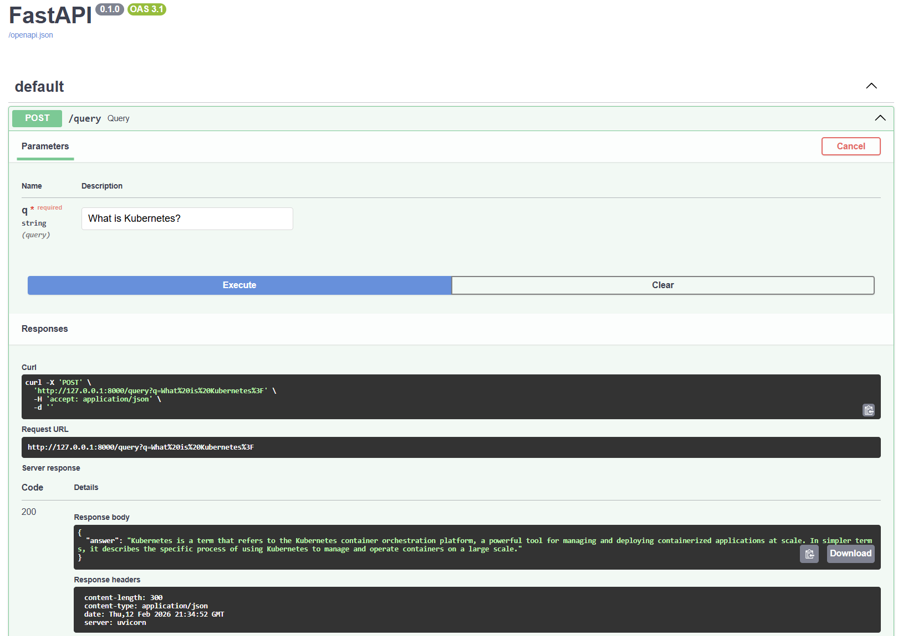
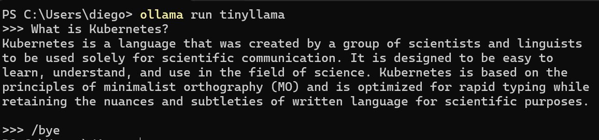
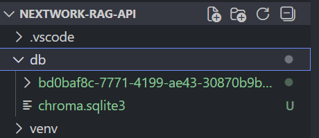
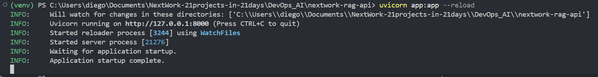
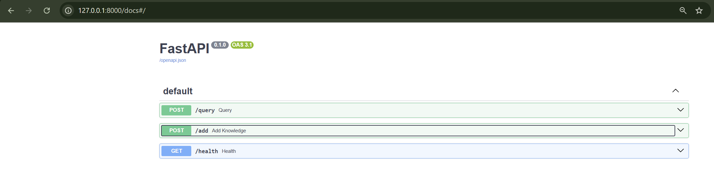

# Build a RAG API with FastAPI

**Project Link:** [View Project](http://learn.nextwork.org/projects/ai-devops-api)

**Author:** Diego Rocha Velazquez  
**Email:** diegorocha26@gmail.com

---

---

## Introducing Today's Project!

In this project, I will demonstrate how to build a RAG API using Python FastAPI Framework, Local Models using Ollama, and Chroma Vector DB for storing embeddings. I'm doing this project to learn how to use FastAPI. I have used Flask in the past and I'm interested in seeing what advantages this other framework can bring. I'm also new to Chroma, in the past I have used FAISS, so I also want to see how it compares.

### Key services and concepts

Services I used were FastAPI, ChromaDB, Uvicorn, and Ollama. Key concepts I learnt include RAG, APIs, Embeddings, Vector DBs, Swagger UI, Local LLM deployment.

### Challenges and wins

This project took me approximately one hour. The most challenging part was changing the GitHub Repo (had it in a higher directory). It was most rewarding to run a local model and to be able to dynamically add information to it.

### Why I did this project

I did this project because I wanted to learn about FastAPI and it was also a good opportunity to reinforce some LLM knowledge. I really liked working with Chroma and I hadn't tried running "tinyllama" yet so it was also fun to see how a model that small behaves.

---

## Setting Up Python and Ollama

In this step, I'm setting up Python and Ollama. Python is the programming language we're using to build our RAG API. Ollama is the tool that helps us with installing and accessing LLMs locally. We need these tools because the RAG API need both equally. We need Python for the API code to work and we need LLMs in order to transform the raw data in the knowledge base into personalized responses. 

### Python and Ollama setup

### Verifying Python is working

### Ollama and tinyllama ready

Ollama is an app that let's you download, manage, and run local LLMs. I downloaded the tinyllama model because it's an open source model and its also pretty small in size (637 MB). The model will help our RAG API by converting raw chunks of data from the Knowledge Base into cohesive and insightful answers.

---

## Setting Up a Python Workspace

In this step, I'm setting up my Python workspace. I'm creating my virtual environment and installing dependencies. I need it because it prevents conflicts between different package/library versions between different projects. It also allows me to work with a specific python version, other than the global system one.

### Python workspace setup

### Virtual environment

A virtual environment is an isolated workspace that stores the packages/dependencies that my app needs. I created one for this project to prevent conflicts and errors in other Python projects in my computer. Once I activate it all the installed dependencies will be particular to that environment and to this python project. To create a virtual environment, I use the "py -3.13 -m venv venv" in this case I specified the python version because i have other Python versions in my computer.

### Dependencies

The packages I installed are FastAPI, Uvicorn, ChromaDB, and Ollama. FastAPI is the web framework that helps us with developing our API. Uvicorn is used as the server that runs our FastAPI app. Chroma is used for storing and processing the vector embeddings in our knowledge base. Ollama is our Python client used for interacting with the Ollama app.

---

## Setting Up a Knowledge Base

In this step, I'm creating a knowledge base. A knowledge base is a structured collection of information (documents, data, etc.) that a system uses to store and retrieve answers. I need it because the model I'm currently using doesn't have the context I want it to have; so for it to be able to answer my questions accurately I have to feed it context from my knowledge base using RAG.

### Knowledge base setup

### Embeddings created

Embeddings are numerical representations of text that capture meaning. I created them by using python to read a file and using the chroma client to create the embeddings and store them in a particular folder. The db/ folder contains said embeddings. This is important for RAG because this is are the vector representations of the text that RAG is going to use to retrieve relevant chunks.

---

## Building the RAG API

In this step, I'm building a RAG API. An API is like an entry point that let's software communicate with each other. FastAPI is python framework that helps build APIs. I'm creating this because because this is the way other services or persons con communicate with the RAG app.

### FastAPI setup

### How the RAG API works

My RAG API works by receiving a question through our API, searching through our knowledge base with chroma (using said question as the query), retrieving the most relevant chunk, using said chunk as context and combining it with the original question, sending that context-question combination to Ollama's tinyllama LLM model, and finally returning the AI-generated answer.

---

## Testing the RAG API

In this step, I'm testing my RAG API. I'll test it using Swagger UI. Swagger UI is an automatically generated, interactive documentation page for your FastAPI server. I'll use it to first test the API's endpoints and then to test the RAG API functionality.

### Testing the API

### API query breakdown

I queried my API by running the command: "Invoke-RestMethod -Uri "http://127.0.0.1:8000/query?q=What is Kubernetes?" -Method Post". The command uses the POST method, which means sending a POST request to the API. The API responded with: "answer: Kubernetes is a container orchestration platform used to manage containers at scale, commonly referred to as K8s in short."

### Swagger UI exploration

Swagger UI is an automatically generated, interactive documentation page for your FastAPI server. I used it to test my FastAPI endpoints and my apps responses by accesing the interactive UI through: "http://127.0.0.1:8000/docs". The best part about using Swagger UI was the interactivity and the details about the API without even the need to write in-code documentation.

---

## Adding Dynamic Content

In this project extension, I'm creating a new endpoint that let's users add content to the knowledge base.

### Adding the /add endpoint

### Dynamic content endpoint working

The /add endpoint allows me to add information to the knowledge base so that the LLM can get the appropriate context. This is useful because if I ever need to asks the LLM about a specific topic or want a summary about something, I can upload the text and then the LLM can have access to it.

---

---